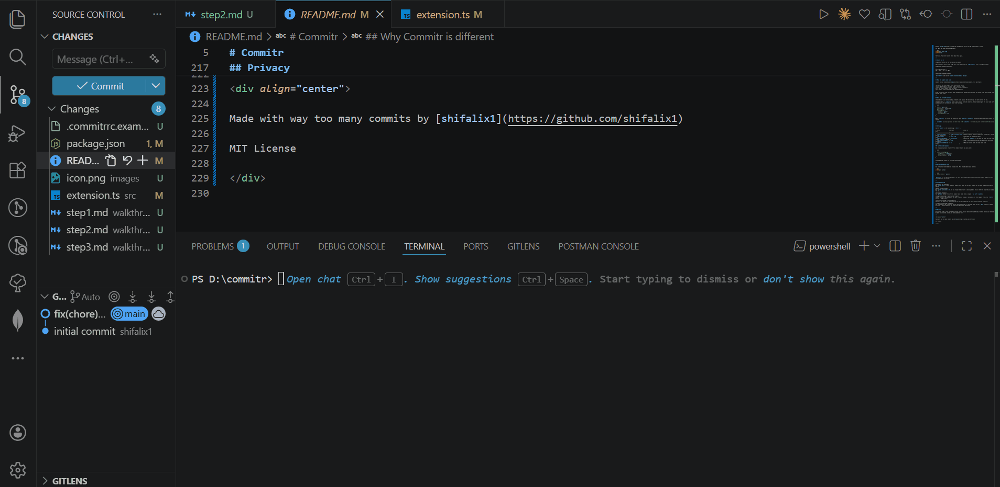

<div align="center">

<br />

# Commitr

### Your staged diff goes in. A real commit message comes out.

Runs on your machine. No API keys. No internet. No nonsense.

<br />



<br />

[](https://marketplace.visualstudio.com/items?itemName=shifalix1.commitr)
[](LICENSE)
[](https://ollama.com)

</div>

---

## What it does

You stage your files. You press one button. Commitr reads your diff, understands what actually changed, and runs:

```
git commit -m "feat(auth): add token expiry check on protected routes"
```

directly in your terminal. No copy-pasting. No thinking about format. Just a clean, meaningful commit in your history.

## Why Commitr is different

Most tools generate commit messages. Commitr focuses on generating the _right_ commit message for how developers actually work.

**1. Fully local. No API. No data leaving your machine.**

Your diff never leaves your system. No tokens, no billing, no rate limits. Works offline, even on a plane.

**2. Built for messy, real workflows**

Most tools assume clean, incremental commits. Commitr is designed for when you have 20 files staged after a sprint and need to make sense of them. It reads the diff and tells the story.

**3. Scope is inferred, not guessed**

Commitr understands your project structure and maps file paths to meaningful scopes automatically.
`src/auth/login.ts → feat(auth)`
No manual tagging, no thinking.

**4. It focuses on meaning, not just format**

Other tools often produce technically correct but useless messages.
Commitr prioritizes what changed _and why_, not just which files were touched.

**5. Zero friction**

No copying. No pasting. No switching tabs.
You stage files, trigger Commitr, and the commit runs directly in your terminal.

---

Commitr is not trying to be another AI feature.
It solves a very specific problem: turning diffs into meaningful history without breaking your flow.

---

## Before you start

Commitr uses [Ollama](https://ollama.com) to run AI locally. Two steps, one time only:

**1. Install Ollama**

Head to [ollama.com](https://ollama.com) and download it for your OS. Takes about a minute.

**2. Pull the model and start Ollama**

```bash
ollama pull qwen2.5:3b
ollama serve
```

That's it. You never have to think about this again.

---

## How to use it

**Option 1 - Button in the Source Control panel**

Open the Source Control tab, stage your files, and click the `$(git-commit)` icon in the panel header.

**Option 2 - Keyboard shortcut**

```
Ctrl + Shift + Alt + C
Cmd + Shift + Alt + C  (Mac)
```

**Option 3 - Command Palette**

`Ctrl+Shift+P` and search `Commitr: Generate Commit Message`.

---

## What the output looks like

Commitr follows [Conventional Commits](https://www.conventionalcommits.org/) by default:

```
feat(auth): add token expiry check on protected routes
fix(ui): guard against null user prop in UserCard render
refactor(api): simplify response pipeline with error boundary
docs: add docker compose setup to readme
chore: update esbuild and typescript devDependencies
```

Scope is inferred from your file paths automatically. Changed files all over the place? Scope gets omitted so the message stays clean.

---

## Solo dev or team? Both work.

**Solo dev** - just install and go. Commitr picks up your VS Code settings and works out of the box.

**Team** - drop a `.commitrrc` file in your project root and commit it. Every teammate gets the exact same config automatically. No one needs to touch their settings.

```json
{
  "model": "qwen2.5:3b",
  "commitStyle": "conventional",
  "generateBody": true,
  "scopeMappings": {
    "src/auth": "auth",
    "src/api": "api",
    "src/components": "ui"
  }
}
```

When `.commitrrc` is active, the status bar shows `Commitr [.commitrrc]` so everyone knows the shared config is running.

> `ollamaUrl` is always personal and never read from `.commitrrc`. Everyone can point to their own Ollama instance.

---

## Settings

Search `Commitr` in VS Code Settings (`Ctrl+,`).

| Setting                 | Default                  | What it does                                                                           |
| ----------------------- | ------------------------ | -------------------------------------------------------------------------------------- |
| `commitr.ollamaUrl`     | `http://localhost:11434` | Where Ollama is running. Change this if you use a custom port or remote host.          |
| `commitr.model`         | `qwen2.5:3b`             | Any model you have pulled works here.                                                  |
| `commitr.commitStyle`   | `conventional`           | Switch to `freeform` if you want the model to write freely without enforcing a format. |
| `commitr.generateBody`  | `true`                   | Adds a short explanation body for diffs that touch 3 or more files.                    |
| `commitr.scopeMappings` | `{}`                     | Map your custom paths to scope names (see below).                                      |

### Custom scope mappings

Got an unusual project structure? Tell Commitr how to map your paths:

```json
{
  "commitr.scopeMappings": {
    "src/payments": "payments",
    "mobile/screens": "screens",
    "infra/terraform": "infra"
  }
}
```

Custom mappings always win over the inferred ones.

---

## Using a different model

Any instruction-tuned model on Ollama works. Pull it and update your setting:

```bash
ollama pull mistral
```

```json
{ "commitr.model": "mistral" }
```

`qwen2.5:3b` is the default because it is fast, small, and produces clean conventional commit output with very little drift on the format.

---

## Troubleshooting

**Ollama is not running**
Run `ollama serve` in your terminal. Commitr will offer to copy this command for you when it detects Ollama is offline.

**Model is not pulled**
Run `ollama pull qwen2.5:3b`. If you trigger Commitr with a missing model, it will offer to copy the pull command for you.

**No staged changes**
Run `git add` on your files first. Commitr only reads what is staged (`git diff --cached`).

**Output looks wrong or ignores the format**
Commitr will warn you and ask if you want to use it anyway or discard it. If this happens often, try `freeform` mode or a larger model.

**Button not showing in the SCM panel**
Make sure you have a git repository open in your workspace and the built-in Git extension is active.

**.commitrrc not being picked up**
The file needs to be in the root of your workspace folder, at the same level as your `.git` directory. Commitr will show a warning toast if the file exists but cannot be parsed.

---

## Privacy

Your staged diff is sent to a model running locally on your machine through Ollama. Nothing leaves your network. No data is collected, stored, or sent anywhere. Ever.

---

<div align="center">

Made with way too many commits by [shifalix1](https://github.com/shifalix1)

MIT License

</div>
